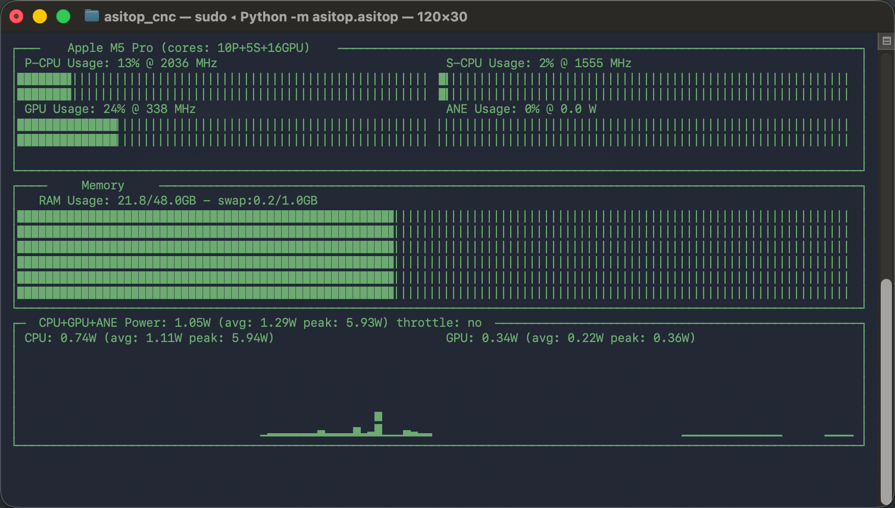

# asitop_cnc

Forked version of `asitop`. The suffix 'cnc' stands for Core Name Compatible.

---

## 与原版有什么区别？

### 核心名兼容
Apple将M5 Pro/Max芯片核心更改为P核与S核，不再为E核与P核。
原版asitop无法解析，此版本进行了兼容。

### 优化硬盘写入
修改了原版先写plist再读去解析的流程，长时间运行不再消耗硬盘写入。

### 修改核心占用率计算逻辑
统计核心平均活动ratio而不是簇ratio。
